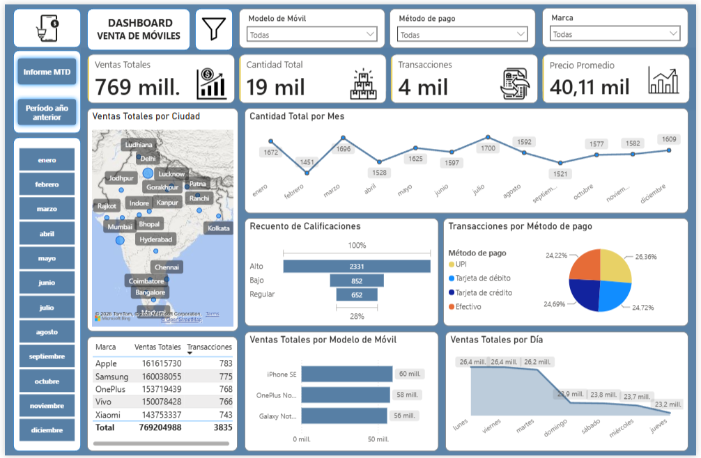
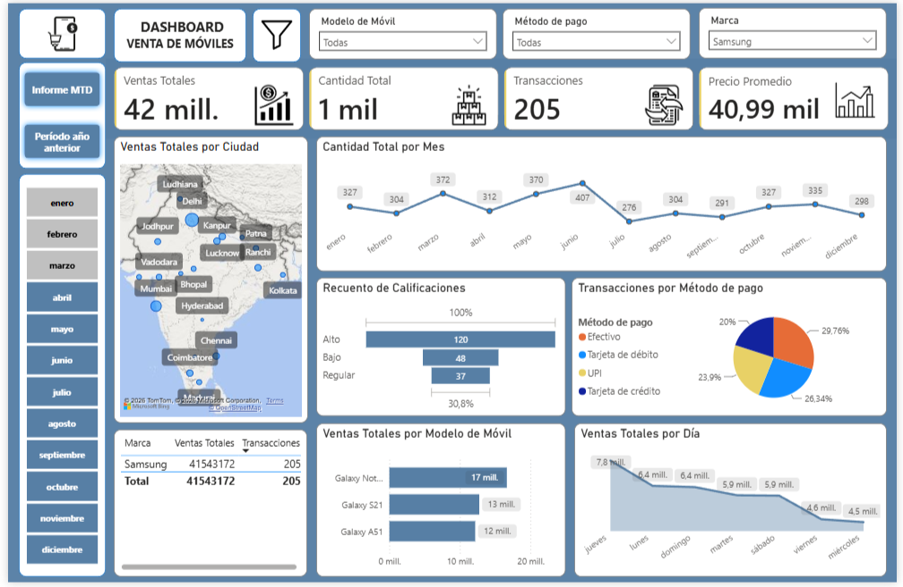
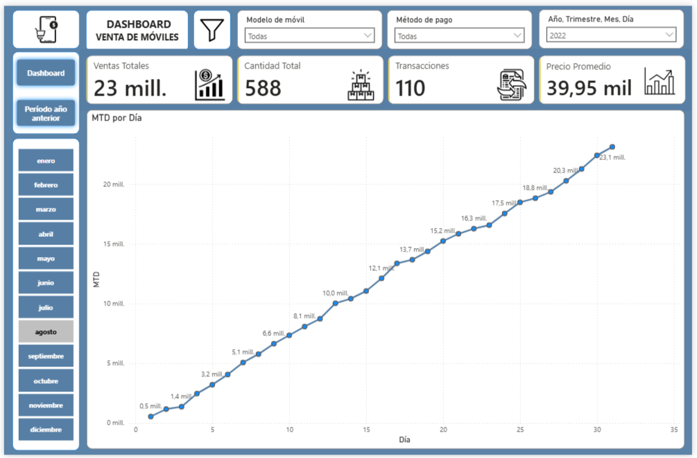
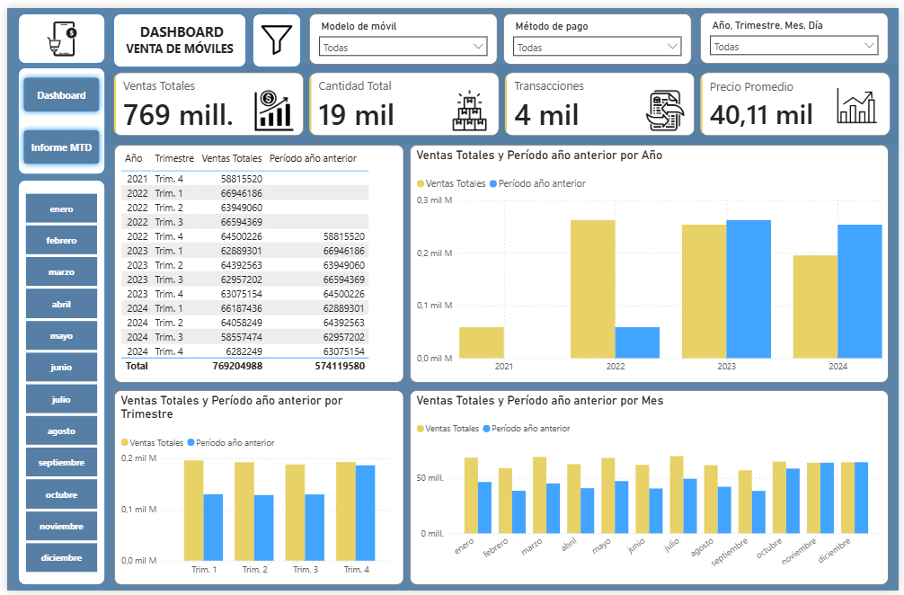
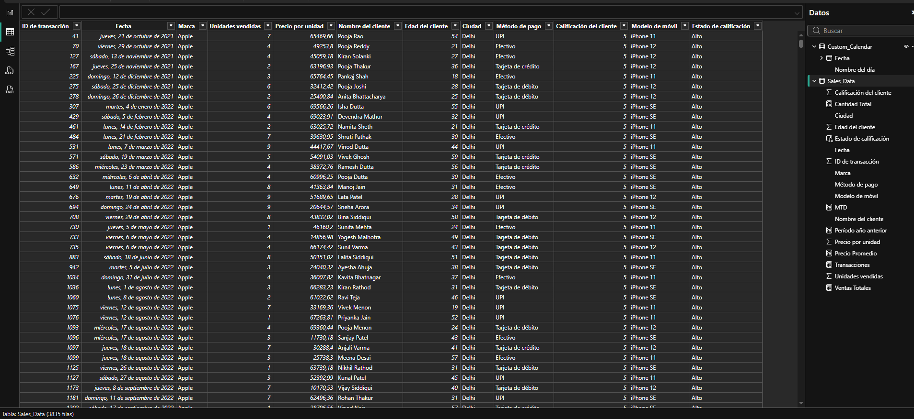

# Dashboard de Ventas de Dispositivos Móviles | Power BI
Repositorio orientado al desarrollo de un dashboard interactivo en Power BI para el análisis de un conjunto de datos de ventas de dispositivos móviles.

El proyecto incluye las etapas de limpieza, transformación, modelado y visualización de datos mediante Power Query y DAX, con el objetivo de analizar el desempeño de las ventas a través de indicadores clave (KPIs), análisis temporal y visualizaciones interactivas.

---

## Objetivos del proyecto

- Analizar el desempeño de las ventas mediante indicadores clave (KPIs)
- Identificar tendencias y patrones en el comportamiento de las ventas
- Analizar las ventas según diferentes dimensiones, como marca y ubicación
- Comparar el rendimiento de las ventas con el mismo período del año anterior
- Desarrollar un dashboard interactivo para facilitar el análisis de datos

---

## Tecnologías utilizadas

- Power BI Desktop
- Power Query
- DAX

---

## Proceso desarrollado

Durante el proyecto se realizaron las siguientes etapas:

- **Importación y limpieza de datos mediante Power Query**

  Se importó el archivo `Mobile Sales Data.xlsx` como fuente de datos y se realizó la preparación inicial de la información.

- **Transformación y preparación de los datos**

  Se realizaron diferentes transformaciones, incluyendo la estructuración de columnas, modificación de tipos de datos, reemplazo de valores y creación de nuevos campos.

- **Creación de un calendario personalizado**

  Se desarrolló una tabla calendario mediante una consulta en blanco, utilizada posteriormente para facilitar el análisis temporal.

- **Desarrollo del modelo de datos y sus relaciones**

  Se estableció la relación entre el calendario personalizado y la tabla principal de datos para permitir el análisis temporal mediante medidas DAX.

- **Creación de medidas DAX y KPIs**

  Se desarrollaron medidas para el cálculo de indicadores relevantes y columnas calculadas para generar información adicional utilizada en el análisis y las visualizaciones.

- **Desarrollo de visualizaciones**

  Se desarrollaron tres páginas de análisis, utilizando diferentes tipos de gráficos según el objetivo de cada una. La página **Dashboard** presenta una visión general del desempeño de las ventas mediante KPIs, gráficos, mapas y otros recursos visuales. La página **Informe MTD** se centra en la evolución diaria de las ventas dentro de un período mensual, mientras que la página **Período año anterior** permite comparar los resultados con el mismo período del año anterior.

- **Implementación de segmentadores, filtros e interacciones**

  Se incorporaron segmentadores y filtros para facilitar el análisis según diferentes dimensiones, junto con la configuración de interacciones entre visualizaciones para controlar cómo responden los elementos del informe ante los filtros aplicados.

## Dashboard

### Vista general

### Interactividad

La información puede explorarse dinámicamente mediante segmentadores y filtros. En la siguiente vista se muestra el dashboard con el primer trimestre del año seleccionado y la marca Samsung como criterio de filtrado.

### Informe MTD

La siguiente vista muestra la evolución diaria de las ventas mediante el análisis Month-to-Date (MTD) para agosto de 2022.

### Período año anterior

Esta página permite comparar las ventas con el **mismo período del año anterior**, utilizando medidas DAX basadas en la función `SAMEPERIODLASTYEAR`.

### Tabla y Datos

---

## Archivos de proyecto

- `Mobile Sales Dashboard.pbix` → Desarrollo completo del proyecto en Power BI.
- `data/Mobile Sales Data.xlsx` → Conjunto de datos original utilizado como fuente.
- `images/` → Capturas de las diferentes páginas del informe.
- `README.md` → Documentación del proyecto.
